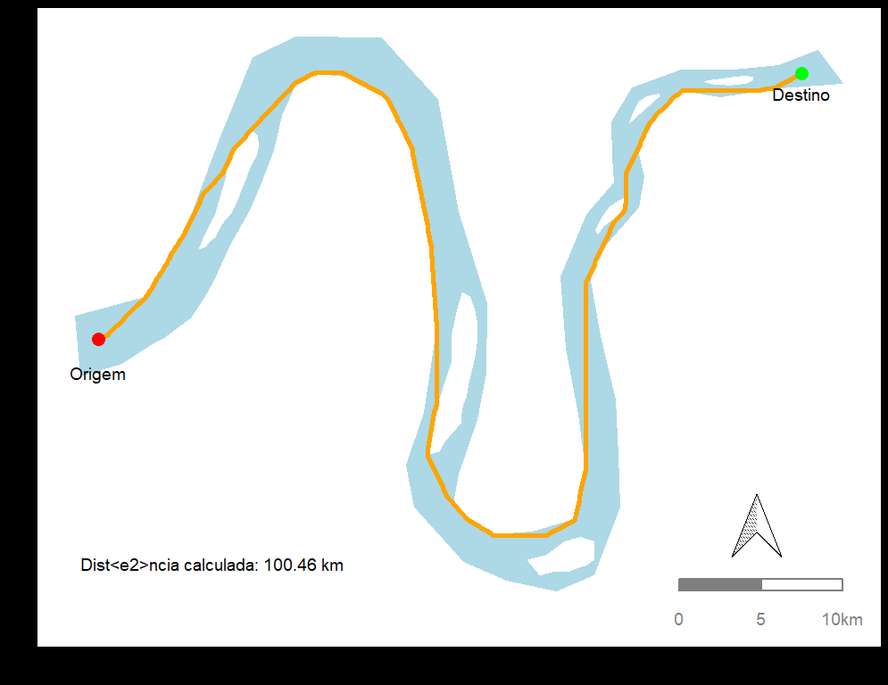
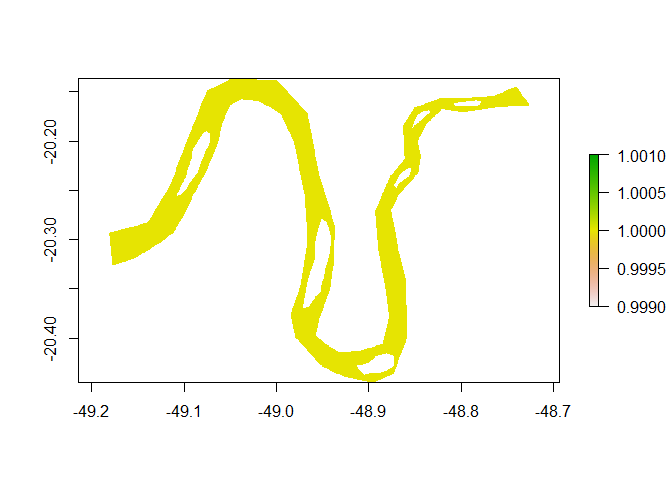
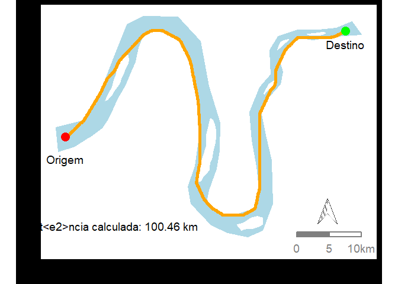

<style type="text/css">
  body{
  font-size: 14pt;
  color: #B9BBB6;
  text-align: justify;
  background-color:black;
}
</style>


 &nbsp;  &nbsp;  &nbsp;    {width=110px}    &nbsp;  &nbsp;  &nbsp;   {width=250px} {width=100px}       &nbsp; &nbsp; &nbsp;     {width=100px}  &nbsp;  &nbsp;  &nbsp;   {width=100px}  


# Menor caminho entre dois pontos {.tabset}

Este documento foi criado para auxiliar quem precisa encontrar o menor caminho entre dois ou mais pontos dentro de um polígono, levando em consideração os limítes da área.


Como exemplo, criei um polígono de rio, que contém ilhas e curvas. O objetivo é criar um caminho entre as ilhas e curvas que ligue dois pontos (como apresentado na **Figura 1**). Os pontos podem estar em um arquivo **.csv ** ou em um outro arquivo **.shp **. Neste caso preferi copiar as coordenadas para ter menos arquivos de entrada. selecionei um trecho de rio qualquer (não fiz questão de registrar o nome do rio para não desviar a atenção), criei um arquivo **.shp ** e desenhei o contorno do rio e depois criei os buracos das ilhas (as ilhas não existiam no rio, eu inventei). Para criação do polígono utilizei o software QGIS.

<br />


  


**Figura 1.** Polígono do rio e pontos de origem e de destino. O objetivo deste roteiro é criar um caminho entre os dois pontos que considere as margens do polígono (linha laranja).

<br />

O documento está dividido em partes, que podem ser acessada nas abas da tabela de acordo com os ítens abaixo:

  1.1. Carregar os pacotes
  
  1.2. Carregar o polígono do rio
  
  1.3. Criação do grid e da camada raster
  
  1.4. Criação da camada de transição e do menor caminho
  
  1.5. Função que calcula o tamanho do seguimento (distância entre os dois pontos)


<br />
<br />

## Pacotes

Pacotes para o tratamento dos dados:

```{.r .bg-info}
library(raster)
library(gdistance)
library(dplyr)
```

<br />
Pacotes para para o processamento dos dados geográficos e ciração do mapa.

```{.r .bg-info}
library(ggplot2)
library(ggthemes)
library(ggsn)
library(ggspatial)
library(sf)
```

<br />
<br />
<br />
<br />

## Carregar os dados

O primeiro passo é carregar o polígono do rio, para isso, utilisei a função "shapefile" do pacote "raster". Depois armazenei os pontos de origem e de destino em duas variáveis. Preferi copiar as coordenadas para ter um arquivo de entrada a menos. Mas essas coordenadas poderiam estar em um arquivo ou em outra camada. 


```{.r .bg-info}
# Carrega o poligono do rio no formato .shp
rio <- shapefile("rio.shp")

# Cria dois pontos que precisarão ser conectados
origem <- c(-49.16760,-20.30495)
destino <- c(-48.75058,-20.15693)
```

<br />
<br />
<br />
<br />

## Grid e raster

Em seguida é necessário criar uma camada no formato raster que será utilizada para criar a camada de transição. Para isso será necessário escolher o tamanho das células do grid. Lembrando que o tamanho é muito particular, dependende do nível de detalhes necessário para que toda a área contenha células. 


```{.r .bg-info}
# Cria o grid na 攼㸱rea do pol攼㹤gono
grid <- makegrid(rio, cellsize = 0.0005) # Tamanho da célula em unidades de mapa!

# O grid 攼㸹 um data.frame. para transformar em um  conjunto de dados espaciais utiliza-se a funcao SpatialPoints
grid <- SpatialPoints(grid, proj4string = CRS(proj4string(rio)))

# Extrair somente a parte do grid que intersepta o poligono do rio
grid <- grid[rio, ]

# Converte o grid novamente em um data.frame para criacaodo raster
grid_df <- as.data.frame(grid)

# Atribui um valor para as celulas que estao no rio (agua)
grid_df$value <- 1

# Cria o raser do data.frame
rio_raster <- rasterFromXYZ(grid_df)

plot(rio_raster)
points(x = -48.70708, y = -22.17826, col = "red", cex = 4)
```




<br />
<br />
<br />
<br />

## Camada de transição

Para criar o caminho em um raster é necessário que seja criado uma camada de transição. Para isso, utilizei a função "transition", do pacote "gdistance". Para quem já possui um raster da área desejada, ou preferiu criar o raster com outro software, basta carregar o raster a partir desta etapa. 

<br />


```{.r .bg-info}
# Transforma o raster em uma camada de transição
rio_tr <- transition(rio_raster, mean, directions = 8)
rio_tr <- geoCorrection(rio_tr, "c")
```
<br />
O menor caminho é criado com a função 'shortestPath' também do pacote 'ggdistance'. Utilizei a função CRS para assinar um crs ao caminho.
<br />

```{.r .bg-info}
# Função que cria o menor caminho (pacote gdistance)
caminho <- shortestPath(rio_tr, origem, destino, output = "SpatialLines")
crs(caminho) <- CRS("+proj=longlat +datum=WGS84")
```

<br />

A seguir a instruçao de como foi feito o plot que é apresentado na introdução.


```{.r .bg-info}
# Funcao que cria o menor caminho (pacote gdistance)
caminho <- shortestPath(rio_tr, origem, destino, output = "SpatialLines")
crs(caminho) <- CRS("+proj=longlat +datum=WGS84")

label_compr <- paste0("Dist攼㸲ncia calculada: ", round(SpatialLinesLengths(caminho), 2), " km")

rio <- st_as_sf(rio)
caminho <- st_as_sf(caminho, crs = CRS('+proj=longlat +datum=WGS84'))


# Armazena os limites da area do rio para rosa dos ventos 
xmin <- extent(rio)[1]
xmax <- extent(rio)[2]
ymin <- extent(rio)[3]
ymax <- extent(rio)[4]

ggplot() +
  geom_sf(data = rio, fill = "lightblue", color = "lightblue") +
  # Dados dos peixes
  geom_sf(data = caminho, col = "orange", lwd = 2) +
  
  geom_point(data = NULL, aes(x = origem[1], y = origem[2]), col = "red", size = 5) +
  geom_text(data = NULL, aes(x = origem[1], y = origem[2], label = "Origem"),
            size = 5, vjust = 3) +
  
  geom_point(data = NULL, aes(x = destino[1], y = destino[2]), col = "green", size = 5) +
  geom_text(data = NULL, aes(x = destino[1], y = destino[2], label = "Destino"), 
            size = 5, vjust = 2) +
  
  scalebar(dist = 5, dist_unit = "km", x.min =  xmin, x.max = xmax, y.min = ymin, y.max = ymax,
           transform = T, model = "WGS84", location = "bottomright", st.dist = 0.05, st.color = "grey50", box.fill = c("grey50", "white"), box.color = "grey50") +
  north(x.min =  xmin, x.max = xmax, y.min = ymin, y.max = ymax, scale = 0.12, anchor = c(x = -48.75, y = -20.39), symbol = 4) +
  
  annotate("text", x = -49.1, y = -20.43, label = label_compr, size = 5) +
  
  ylab("") +
  xlab("") +
  
  theme_base() +
  theme(axis.text = element_blank(),
        axis.ticks = element_blank(),
        plot.background = element_rect(fill  = "black"))
```


<br />
<br />
<br />
<br />

## Distância hidrica
Para calcular a distância hídrica utilizei a fução "SpatialLinesLengths" do pacote "sp". Importante notar que foi utilizado o argumento "latlong = T", para retornar a distância em km.


```{.r .bg-info}
caminho <- shortestPath(rio_tr, origem, destino, output = "SpatialLines")
crs(caminho) <- CRS("+proj=longlat +datum=WGS84")
SpatialLinesLengths(caminho, longlat = T)
```

```
## [1] 100.4559
```

<br />
<br />
<br />
<br />

</br >
</br >

#

Leonardo Donato Nunes [{width=40px}](https://www.linkedin.com/in/leonardo-donato-nunes-754aa5b8?lipi=urn%3Ali%3Apage%3Ad_flagship3_profile_view_base_contact_details%3BZeE8YK6ARgGfUOtWF8bkxg%3D%3D){style="float:right"} &nbsp;  &nbsp;  &nbsp;  &nbsp; [{width=40px}](leonardodonatonunes@yahoo.com.br){style="float:right"} &nbsp;  &nbsp;  &nbsp;  &nbsp; [{width=45px}](https://github.com/LeonardoDonatoNunes){style="float:right"} &nbsp;  &nbsp;

Brasil, 25 de Janeiro de 2021

</br >

 <a href="#top">Back to top</a>
